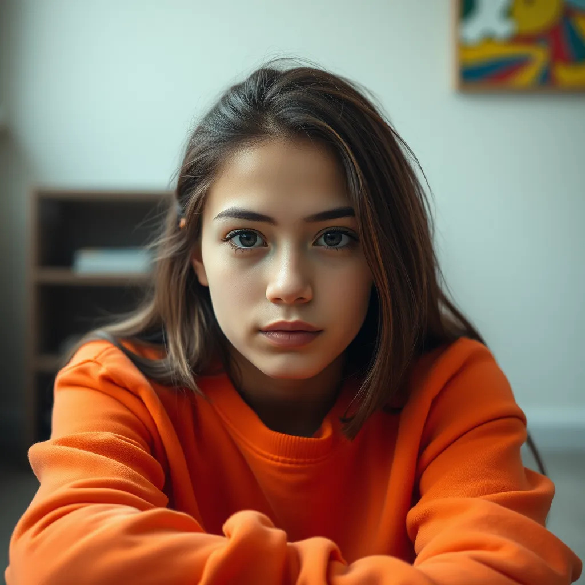

# Image Algorithms 101

This repository helps you practice image algorithms and techniques.



## Topics covered

- [ ] Adaptive Filters
- [ ] Coding and Compression
- [ ] Color Image Processing
- [ ] Graphics Algorithms
- [ ] Histogram Techniques
- [ ] Image Fundamentals
- [ ] Mensuration
- [ ] Morphological Filters
- [ ] Noise
- [ ] Nonlinear Filters
- [ ] Segmentation
- [ ] Spatial Filters
- [ ] Spatial Frequency Filters
- [ ] Storage Formats
- [ ] Transforms

## Algorithms

### Histograms Techniques

- Brightness
- Contrast

## Steps to get started

1. Create a virtual env

    ```bash
    python -m venv env
    ```

    Activate the env

    ```bash
    .\env\Scripts\activate
    ```

2. Install dependencies

    ```bash
    pip install -r .\requirements.txt
    ```

3. Run `main.py` to generate files for all questions

    ```bash
    python .\main.py
    ```

4. Find your algorithm inside `algorithms` folder and under respective sub-folder. Complete the function and run to see the output.

    ```bash
    python -m algorithms.<class>.<algorithm>
    ```

    Replace `<class>` with the sub-folder name and `<algorithm>` with the name of the algorithm you opted for. Eg,
    class = histogram_techniques.
    algorithm = brightness
    The commad would be:

    ```bash
    python -m algorithms.histogram_techniques.brightness
    ```
